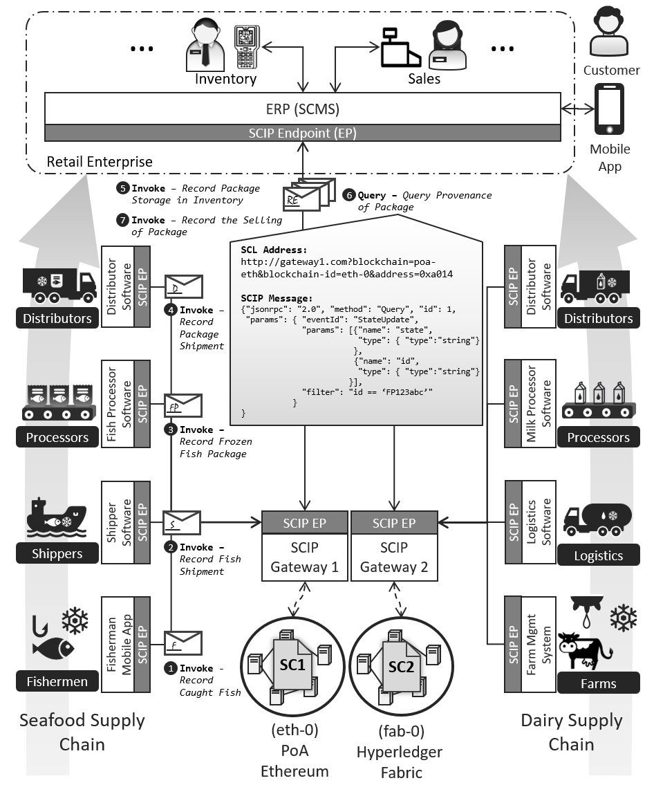

# Unified Integration of Smart Contracts through Service Orientation - A Case-Study

## Introduction

A case-study that shows how the [Smart Contract Locator (SCL)](https://github.com/ghareeb-falazi/scl), the [Smart Contract Description Language (SCDL)](https://github.com/floriandanielit/scdl), and the [Smart Contract Invocation Protocol (SCIP)](https://github.com/lampajr/scip) can be used in combination to support the integration of heterogeneous multi-blockchain setups into client applications.

The following picture highlights the distributed system that is invloved in the case study:

The system focuses on a retailer enterprise that is connected to two supply chains (one for seafood products and one for dairy products).
The two supply chains are managed by two blockchains ([Ethereum](https://ethereum.org/) and [Hyperledger Fabric](https://www.hyperledger.org/projects/fabric)).
Access to the blockchains is provided by two [SCIP Gateways](https://github.com/ghareeb-falazi/BlockchainAccessLayer), which can be activated using SCIP messages addressed at appropriate SCL addresses.
We will create the various components of this system, bring it up and then run a sample the client application against it.
The sample client application allows the various roles presented in the figure to update the corresponding blockchains with supply-chain-related actoins.
Furthermore, it allows the end-customer to query the provenance of a given fish package or a milk carton.

## Prerequisits

- Active internet connection :)
- [Docker](https://www.docker.com/) with [Docker-Compose](https://docs.docker.com/compose/)
- [Git bash](https://git-scm.com/downloads) (for Windows users)
- The ports 4200, 7050, 7051, 7054, 8080, 8081, 8082 8545 must be avaialable at the host machine.

## Setup

- The following instructions assume you are using Windows. Otherwise, ignore the requirement that you need to run the commands using git bash, since bash will be readily available for you.
- Using git bash, navigate to the `AutomateSetup` directory, and run the shell script `Start.sh`, i.e., 
  ```
  > cd AutomateSetup
  > ./Start.sh
  ```
   This will pull/create the necessary docker images, execute the docker-compose file to bring up the various docker containers needed, and deploy the Ethereum and Fabric smart contracts.
   If you manually change one of the involved `Dockerfile`'s, please use the option `fresh` when running the previous command, i.e., run:
  ```
  > cd AutomateSetup
  > ./Start.sh fresh
  ```
  This will execute `docker-compose build --no-cache` before `executing docker-compose up -d`.

- When the script is fully executed, you can proceed to the [Demo](#demo) section below.
- At the end, you can bring down the network with the command 


  ```
  > ./Stop.sh
  ```

  You can also remove BAL and ganache-cli images by combining the previous command with the `rmi` option as follows:
  
  ```
  > ./Stop.sh rmi
  ``` 
 
## Demo

- After the `Start.sh` script is successfully executed, open the browser to http://localhost:4200.
- Use the UI to add fish-catching entries to the blockchain, and then add further entries that refer to shipping the fish, packaging them, distributing packages to retailers, registering packages in retailers' inventory, and selling them. Behind the scenes, [SCIP Invocation messages](https://github.com/lampajr/scip#invocation) are sent to a [SCIP Gateway](https://github.com/ghareeb-falazi/BlockchainAccessLayer) that translates them into Ethereum trnasactions in this case.
- Finally, use the _Provenance_ tab to query the provenance of a fish package. Behind the scenes, multiple [SCIP Query messages](https://github.com/lampajr/scip#querying) are sent to a [SCIP Gateway](https://github.com/ghareeb-falazi/BlockchainAccessLayer) to retrieve all the events relevant for the corresponding fish package and the contained fish. 
- __A Video of this demo is [available on Youtube](https://youtu.be/Mx3maoWHQ1Y)__
  


## Notes

- The crpyto artifacts for Fabric are already generated. If you need to generate them again use the script [generate.sh](./AutomateSetup/fabric/_defaults-generation/generate.sh). Then you need to update the keyfile name mentioned inside the [docker-compose file](./AutomateSetup/docker-compose.yml) (in the `ca` service specification).
